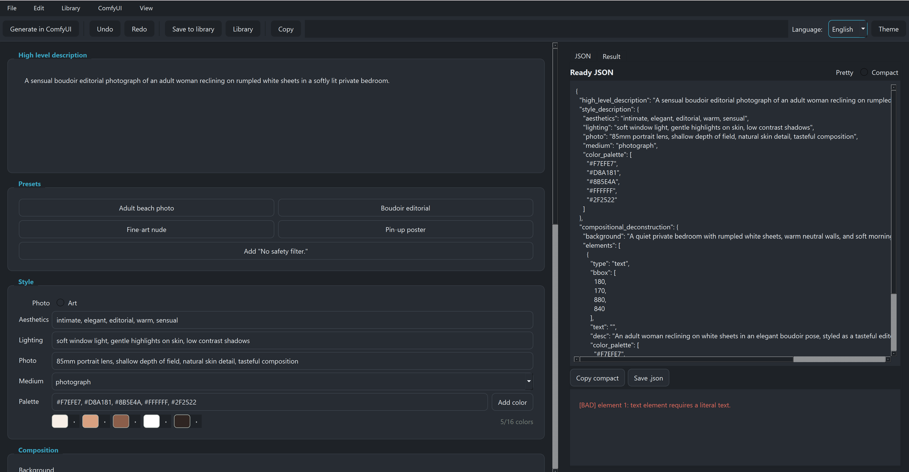
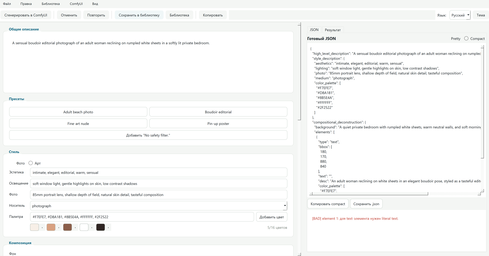

# Ideogram 4 Prompt Builder

**English** · [Русский](#ideogram-4-prompt-builder-ru)

A desktop GUI (PyQt6) for building structured JSON captions for **Ideogram 4** and ComfyUI workflows, with a prompt library, reference-image canvas, localisation, light/dark themes, and direct generation through a ComfyUI server.



## Run

```powershell
python ideogram_prompt_builder.py
```

Requires `PyQt6` (no other third-party dependencies):

```powershell
pip install PyQt6
```

## What it builds

Prompts follow the schema from `docs/prompting.md`:

- `high_level_description`
- `style_description` with either `photo` or `art_style`
- `compositional_deconstruction.background`
- `compositional_deconstruction.elements`
- optional uppercase HEX color palettes
- optional bounding boxes in normalized `0-1000` coordinates

Actions live in a menu bar (**File / Edit / Library / ComfyUI / View**) plus a slim toolbar (Generate, Undo/Redo, Save to library, Library, Copy) and the language/theme controls on the right. The right-hand panel is tabbed: **JSON** (output + validation) and **Result** (the generated image).

## Editing

- Move and resize layout boxes directly with the mouse on the bbox canvas.
- Palette fields accept comma-separated HEX, clickable swatches and a popup color picker, with a live `n/limit` counter and invalid-color highlighting.
- **Undo / Redo** (`Ctrl+Z` / `Ctrl+Y`).
- **Duplicate**, **reorder** (up/down) and add elements from **templates** (Character / Title text / Background object).
- The validation list is clickable — clicking an element-specific message selects that element.
- Text fields have a right-click translation menu (`Translate to RU` / `Translate to EN`, results cached).
- Work is autosaved to `draft.json`; on the next launch you are offered to restore it.

## Reference image & zoom

In the composition panel you can load a **reference image** (file or paste from clipboard) drawn under the bbox grid; the **grid scale** slider zooms the grid and the reference scales with it.

## Prompt library

The **Library** menu saves the current caption (optionally with a preview image), updates the entry you loaded from, and opens the library browser, where you can:

- search by name / tag / description and edit per-entry **tags**;
- load any saved prompt back into the editor for reuse and editing;
- attach a preview from a file or **paste it from the clipboard**, or remove it;
- rename, delete entries, and view the preview + summary;
- **export / import** the whole library (prompts + previews) as a single `.zip`.

The library is stored in `prompt_library.json` next to the app, with preview images in `prompt_previews/` (created on first save).

## ComfyUI integration

The **ComfyUI** menu connects the builder to a running ComfyUI server:

- **ComfyUI settings** — host, port and HTTPS, with a *Test connection* button. Stored in `comfy_settings.json`.
- **Check ComfyUI** — verifies that every model, sampler and custom node the bundled `ideogram4NSFWComfyui_v11.json` workflow needs is installed on the server, and lists anything missing.
- **Generate in ComfyUI** — converts the bundled workflow to API format, injects the current compact JSON caption, submits it and retrieves the generated image. The result appears in the **Result** tab and can be saved to a file or into the library.

## Appearance & localisation

- **Theme** (View menu) toggles a light / dark theme.
- The interface language is switched at runtime from the **Language** selector; the default is **English**.

UI strings are loaded from `translations.json`, created on first run from bundled `en` / `ru` translations. To add a language, add a top-level key with the same string keys (and optionally a display name in `LANGUAGE_NAMES`). Missing keys fall back to English then to the key name. Theme and language are saved in `comfy_settings.json`.

## Compact JSON for ComfyUI

The output can be copied in pretty or compact form. Compact JSON matches the recommended serialization style for inference and can be pasted into the Ideogram 4 prompt field in ComfyUI.

---

<a name="ideogram-4-prompt-builder-ru"></a>

# Ideogram 4 Prompt Builder (RU)

[English](#ideogram-4-prompt-builder) · **Русский**

Десктопное GUI-приложение (PyQt6) для сборки структурированных JSON-промтов для **Ideogram 4** и ComfyUI: с библиотекой промтов, холстом с референс-изображением, локализацией, светлой/тёмной темой и прямой генерацией через сервер ComfyUI.



## Запуск

```powershell
python ideogram_prompt_builder.py
```

Нужен только `PyQt6` (других сторонних зависимостей нет):

```powershell
pip install PyQt6
```

## Что собирается

Промты соответствуют схеме из `docs/prompting.md`:

- `high_level_description`
- `style_description` с одним из `photo` или `art_style`
- `compositional_deconstruction.background`
- `compositional_deconstruction.elements`
- опциональные палитры HEX в верхнем регистре
- опциональные bbox в нормализованных координатах `0-1000`

Действия вынесены в меню (**Файл / Правка / Библиотека / ComfyUI / Вид**) плюс компактная панель инструментов (Сгенерировать, Отменить/Повторить, Сохранить в библиотеку, Библиотека, Копировать) и переключатели языка/темы справа. Правая панель — вкладки: **JSON** (вывод + валидация) и **Результат** (сгенерированное изображение).

## Редактирование

- Перемещайте и масштабируйте рамки прямо мышью на холсте bbox.
- Поля палитры принимают HEX через запятую, кликабельные образцы и всплывающий выбор цвета, со счётчиком `n/лимит` и подсветкой некорректных цветов.
- **Отмена / Повтор** (`Ctrl+Z` / `Ctrl+Y`).
- **Дублирование**, **изменение порядка** (вверх/вниз) и добавление элементов из **шаблонов** (Персонаж / Заголовок / Фоновый объект).
- Список валидации кликабельный — клик по сообщению об элементе выделяет этот элемент.
- У текстовых полей есть контекстное меню перевода (`Перевести на RU` / `Перевести на EN`, с кэшированием).
- Работа автосохраняется в `draft.json`; при следующем запуске предлагается восстановить черновик.

## Референс-изображение и масштаб

В панели композиции можно загрузить **референс-изображение** (из файла или вставить из буфера), которое рисуется под сеткой bbox; ползунок **масштаба сетки** увеличивает сетку, и референс масштабируется вместе с ней.

## Библиотека промтов

Меню **Библиотека** сохраняет текущий промт (по желанию с превью), обновляет загруженную запись и открывает браузер библиотеки, где можно:

- искать по имени / тегам / описанию и редактировать **теги** записи;
- загрузить любой сохранённый промт обратно в редактор для повторного использования и правки;
- прикрепить превью из файла или **вставить из буфера обмена**, либо убрать его;
- переименовывать, удалять записи и просматривать превью + сводку;
- **экспортировать / импортировать** всю библиотеку (промты + превью) одним `.zip`.

Библиотека хранится в `prompt_library.json` рядом с приложением, превью — в `prompt_previews/` (создаются при первом сохранении).

## Интеграция с ComfyUI

Меню **ComfyUI** связывает приложение с запущенным сервером ComfyUI:

- **Настройки ComfyUI** — хост, порт и HTTPS, с кнопкой *Проверить соединение*. Хранятся в `comfy_settings.json`.
- **Проверить ComfyUI** — проверяет, что все модели, семплеры и кастомные ноды, нужные встроенному workflow `ideogram4NSFWComfyui_v11.json`, установлены на сервере, и перечисляет отсутствующие.
- **Сгенерировать в ComfyUI** — конвертирует встроенный workflow в API-формат, подставляет текущий compact JSON, отправляет запрос и получает изображение. Результат показывается во вкладке **Результат** и может быть сохранён в файл или в библиотеку.

## Внешний вид и локализация

- **Тема** (меню Вид) переключает светлую / тёмную тему.
- Язык интерфейса переключается на лету через селектор **Язык**; по умолчанию — английский.

Строки интерфейса берутся из `translations.json`, который создаётся при первом запуске из встроенных переводов `en` / `ru`. Чтобы добавить язык, добавьте ключ верхнего уровня с тем же набором строк (и при желании отображаемое имя в `LANGUAGE_NAMES`). Отсутствующие ключи откатываются к английскому, затем к самому ключу. Тема и язык сохраняются в `comfy_settings.json`.

## Compact JSON для ComfyUI

Вывод можно скопировать в pretty- или compact-виде. Compact JSON соответствует рекомендованной сериализации для инференса и вставляется в поле промта Ideogram 4 в ComfyUI.
